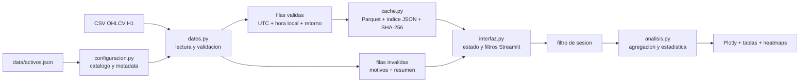

# Seasonal Market Dashboard | Analisis estacional H1

[Repositorio publico](https://github.com/Seggov/seasonal-market-dashboard)

Dashboard local construido con Streamlit para explorar patrones temporales en
**604.111 velas OHLCV H1** de ocho instrumentos financieros. La aplicacion
valida los datos, conserva su semantica temporal, calcula retornos descriptivos
y permite analizarlos por mes, semana, dia y hora sin depender de APIs durante
la ejecucion.

> El proyecto es una herramienta de exploracion estadistica. No genera senales,
> predicciones ni recomendaciones de inversion.

## Vista principal: matriz dia-hora

La matriz cruza el dia de la semana con la hora local del mercado. Permite
alternar entre media, mediana, porcentaje positivo, desviacion y numero de
observaciones, ademas de aplicar un filtro IQR y un minimo de muestras por
celda.


Las capturas corresponden a ejecuciones locales del dashboard. Los resultados
son descriptivos y pueden incluir periodos parciales, como el mes o ano en
curso.

## Por que realice este proyecto

Realice este proyecto para convertir historiales financieros dispersos en una
herramienta reproducible y facil de inspeccionar. Queria ir mas alla de un
notebook aislado y construir una aplicacion donde fuera posible:

- comparar patrones estacionales sin mezclar instrumentos que no son
  equivalentes, como un indice oficial y su CFD;
- trabajar con datos locales y resultados reproducibles, sin depender de la
  disponibilidad de una API al abrir el dashboard;
- hacer visible la calidad de los datos antes de analizarlos;
- respetar UTC, zonas horarias IANA, DST y sesiones de mercado;
- evitar rellenar huecos o fabricar velas que no existen en la fuente;
- separar configuracion, validacion, estadistica, cache e interfaz para poder
  probar cada responsabilidad de forma independiente.

El objetivo no es demostrar que un patron sea rentable. El dashboard ayuda a
formular preguntas, comparar periodos y detectar comportamientos que despues
deberian evaluarse con tecnicas inferenciales y pruebas fuera de muestra.

## Que permite explorar

La interfaz incluye diez vistas:

1. **Resumen:** cierre reciente, retornos, proporcion de velas positivas y
   candlestick.
2. **Calidad de datos:** filas totales, validas, eliminadas y rango temporal.
3. **Analisis por periodo:** retornos por ano y tabla mensual por ano.
4. **Analisis mensual:** retorno promedio por mes y trayectorias intrames.
5. **Analisis semanal:** estacionalidad por semana ISO con filtro IQR opcional.
6. **Dia de la semana:** retorno diario y trayectorias intradia.
7. **Analisis diario:** comportamiento por dia del mes y heatmap.
8. **Analisis horario:** retorno promedio por hora local.
9. **Matriz dia-hora:** heatmap general y detalle separado por dia.
10. **Eventos extremos:** mejores, peores o movimientos sobre un umbral.

Tambien permite cambiar entre tema claro y oscuro, escoger el activo, aplicar
sesiones declaradas, observadas o personalizadas, y regenerar la cache local.

## Mas capturas

### Retornos anuales y mensuales


### Curvas historicas por mes


## Datos incluidos

El snapshot versionado fue actualizado el **26 de julio de 2026** y contiene
ocho instrumentos con coberturas diferentes:

| Simbolo | Instrumento y fuente | Filas | Cobertura UTC | Zona de analisis |
|---|---|---:|---|---|
| `BTCUSDT` | Bitcoin/USDT spot, Binance | 78.245 | 2017-08-17 a 2026-07-26 | UTC |
| `SP500` | S&P 500 oficial `^GSPC`, Yahoo Finance | 5.081 | 2023-08-25 a 2026-07-24 | `America/New_York` |
| `NIKKEI225` | Nikkei 225 oficial `^N225`, Yahoo Finance | 5.090 | 2023-07-28 a 2026-07-24 | `Asia/Tokyo` |
| `USA500IDXUSD` | US 500 CFD bid, Dukascopy | 74.294 | 2011-09-18 a 2026-07-24 | `America/New_York` |
| `JPNIDXJPY` | Japan 225 CFD bid, Dukascopy | 75.722 | 2011-09-18 a 2026-07-24 | `Asia/Tokyo` |
| `XAUUSD` | Oro spot bid, Dukascopy | 140.352 | 2003-05-05 a 2026-07-24 | `America/New_York` |
| `XAGUSD` | Plata spot bid, Dukascopy | 139.418 | 2003-05-04 a 2026-07-24 | `America/New_York` |
| `WTI_LIGHTCMDUSD` | Petroleo WTI CFD bid, Dukascopy | 85.909 | 2011-09-23 a 2026-07-24 | `America/New_York` |

Los indices oficiales y sus CFD se mantienen separados. Aunque representen
mercados relacionados, tienen proveedores, sesiones, coberturas, precios y
semantica de volumen diferentes.

La procedencia completa, las fechas exactas y los ajustes previos estan
documentados en [`data/FUENTES_DATOS.txt`](data/FUENTES_DATOS.txt).

## Arquitectura

La aplicacion sigue una arquitectura modular: `app.py` solo inicia Streamlit y
la logica se distribuye en modulos con responsabilidades concretas.



### Responsabilidad de cada modulo

| Componente | Responsabilidad |
|---|---|
| `app.py` | Configura la pagina Streamlit y ejecuta la aplicacion. |
| `src/configuracion.py` | Lee `activos.json`, valida campos, rutas y zonas IANA, y construye el catalogo. |
| `src/datos.py` | Lee CSV como texto, valida OHLCV, separa filas invalidas, convierte UTC y calcula retornos por vela. |
| `src/cache.py` | Firma datos y configuracion, guarda Parquet e indice JSON, y verifica integridad con SHA-256. |
| `src/analisis.py` | Agrega periodos y calcula estadistica descriptiva, estacionalidad, IQR, matrices y extremos. |
| `src/interfaz.py` | Coordina Streamlit, sesiones, temas, cache, tablas y visualizaciones Plotly. |
| `tests/` | Pruebas de configuracion, datos, cache y calculos analiticos. |
| `.github/workflows/` | CI con lint basico y pytest en Python 3.10, 3.11 y 3.12. |

### Estructura del repositorio

```text
seasonal-market-dashboard/
|-- app.py
|-- data/
|   |-- activos.json
|   |-- FUENTES_DATOS.txt
|   `-- ocho CSV H1
|-- src/
|   |-- configuracion.py
|   |-- datos.py
|   |-- cache.py
|   |-- analisis.py
|   `-- interfaz.py
|-- tests/
|-- docs/images/
|-- cache/
|-- .github/workflows/
|-- requirements.txt
`-- README.md
```

## Flujo de procesamiento

1. `configuracion.py` carga dinamicamente cada activo declarado en
   `data/activos.json`.
2. El CSV se lee inicialmente como texto para conservar la representacion de
   origen.
3. `datos.py` valida columnas, timestamps, finitud, precios, volumen,
   coherencia OHLC y duplicados.
4. Los timestamps se conservan en UTC y se convierten a la zona IANA del
   mercado para el analisis local.
5. Se calcula el retorno de cada vela desde `open` y `close`.
6. La aplicacion usa una cache de Streamlit para reruns y una cache persistente
   Parquet para los datos procesados.
7. La interfaz aplica el filtro de sesion elegido por el usuario.
8. `analisis.py` agrega el periodo solicitado y calcula las estadisticas.
9. `interfaz.py` presenta resultados mediante tablas y graficos Plotly.

La aplicacion no realiza llamadas de red en este flujo. El boton **Actualizar
datos y cache** vuelve a leer los CSV locales y limpia las caches; no descarga
precios nuevos.

## Contrato y validacion OHLCV

Cada CSV debe contener exactamente estas columnas:

```text
timestamp_utc,open,high,low,close,volume
```

Reglas principales:

- `timestamp_utc` debe ser interpretable como fecha valida;
- `open`, `high`, `low` y `close` deben ser numericos, finitos y no negativos;
- `volume` puede estar vacio, pero debe ser finito y no negativo cuando existe;
- `high` no puede ser menor que `low`, `open` o `close`;
- `low` no puede ser mayor que `open` o `close`;
- los duplicados posteriores se excluyen y se conserva la primera aparicion;
- los huecos no se rellenan y no se generan velas sinteticas.

El simbolo, mercado, timeframe, sesion, fuente y zona horaria proceden de
`activos.json`. El retorno se calcula desde los precios validados; no se confia
en un porcentaje precalculado por la fuente.

## Metodologia de retornos

Para una vela o un periodo agregado se utiliza:

```text
retorno_porcentual = (cierre_final / apertura_inicial - 1) * 100
```

Para periodos de mayor duracion se toma la primera apertura y el ultimo cierre
en orden cronologico. Los retornos simples de las velas no se suman.

El nucleo calcula:

- media, mediana, minimo, maximo, rango y desviacion estandar muestral;
- porcentaje de periodos positivos, negativos y neutros;
- agregacion por hora, dia, semana ISO, mes y ano;
- estacionalidad por mes, semana, dia de semana, dia del mes y hora;
- matriz dia-hora con cinco metricas seleccionables;
- filtro opcional de outliers mediante IQR;
- eventos extremos por ranking o umbral absoluto.

Los promedios mostrados son medias aritmeticas. No se ponderan por volumen,
capital, volatilidad ni tamano de muestra.

## Zonas horarias, DST y sesiones

- Los snapshots actuales almacenan timestamps UTC.
- Cada activo declara una zona IANA, por ejemplo `America/New_York` o
  `Asia/Tokyo`.
- Las agrupaciones por dia, semana, mes y hora se realizan sobre el calendario
  local del activo.
- El offset UTC se conserva al agregar horas para distinguir repeticiones
  causadas por el fin del horario de verano.
- Las barras Yahoo que comienzan a `HH:30` conservan su timestamp, pero la
  estacionalidad horaria las agrupa por la hora entera y etiqueta el bucket como
  `HH:00`.

Modos de sesion:

- **Declarada:** conserva las observaciones publicadas para la sesion indicada.
  No inventa un calendario bursatil.
- **Observada:** permite seleccionar dias y horas presentes en el archivo.
- **Personalizada:** aplica un intervalo `[inicio, fin)` y admite sesiones que
  cruzan medianoche.

`BTCUSDT` usa sesion `24/7`, por lo que conserva toda la serie. La rejilla
esperada puede calcularse con precision, pero el snapshot contiene huecos y no
debe describirse como una serie perfectamente continua.

## Cache e integridad

La cache persistente combina:

- ruta absoluta, tamano, fecha de modificacion y SHA-256 del CSV;
- la misma identidad para `activos.json`;
- una version explicita del procesamiento.

Cada entrada contiene un Parquet y un indice JSON con hash, filas, columnas y
metadata. Las escrituras usan archivos temporales y reemplazo atomico. Una
pareja incompleta, corrupta o incompatible se invalida automaticamente.

Una firma nueva evita reutilizar datos antiguos, pero no elimina todos los
archivos historicos de cache. La limpieza completa se realiza desde la
interfaz.

## Tecnologias

| Area | Tecnologia |
|---|---|
| Interfaz | Streamlit |
| Datos | Pandas, NumPy |
| Visualizacion | Plotly |
| Cache | PyArrow, Parquet, JSON, SHA-256 |
| Zonas horarias | `zoneinfo`, `tzdata` |
| Pruebas | Pytest |
| Integracion continua | GitHub Actions |

## Instalacion

El codigo requiere Python 3.10 o superior. La integracion continua verifica
Python **3.10, 3.11 y 3.12**.

Desde PowerShell:

```powershell
git clone https://github.com/Seggov/seasonal-market-dashboard.git
Set-Location "seasonal-market-dashboard"
python -m venv .venv
.venv\Scripts\Activate.ps1
python -m pip install --upgrade pip
python -m pip install -r requirements.txt
```

## Ejecucion

```powershell
python -m streamlit run app.py
```

La aplicacion necesita permisos de escritura en `cache/` para la cache
persistente y en la raiz para `finance.log`.

## Pruebas y CI

```powershell
python -m pytest -q
```

La suite incluye 31 casos que cubren:

- configuraciones validas, invalidas y modo tolerante;
- contrato CSV, OHLC, duplicados, retornos y metadata derivada;
- conversion de zona horaria y cambio DST;
- cobertura `24/7` y `24/5`;
- firmas, roundtrip e invalidacion de cache corrupta;
- agregacion de retornos, estacionalidad, IQR y matriz dia-hora.

GitHub Actions ejecuta lint basico y pytest en Ubuntu para Python 3.10, 3.11 y
3.12. La interfaz Streamlit y las interacciones Plotly no tienen pruebas de
navegador end-to-end.

## Como agregar un activo

1. Normaliza el historial al contrato OHLCV H1.
2. Guarda el CSV dentro de `data/`.
3. Agrega una entrada a `data/activos.json` con mercado, sesion, zona IANA,
   timeframe, archivo y tipo de timestamp.
4. Documenta proveedor, cobertura y transformaciones en
   `data/FUENTES_DATOS.txt`.
5. Ejecuta la suite de pruebas.

El cargador descubre simbolos dinamicamente. La prueba de regresion del
catalogo actual fija los ocho simbolos versionados, por lo que debe actualizarse
si se incorpora un noveno activo al snapshot oficial.

## Procedencia de precios y volumen

- BTC usa precios y volumen spot de Binance.
- Los indices Yahoo pueden publicar volumen cero o no disponible.
- Dukascopy aporta precios `bid` y volumen del proveedor, no volumen oficial de
  la bolsa o mercado subyacente.
- El volumen se valida, pero actualmente no se analiza ni visualiza.
- Cuarenta y una velas WTI tuvieron antes de ser incorporadas un ajuste maximo
  de `0.002` en `high/low` para restaurar coherencia OHLC. El detalle esta en
  `data/FUENTES_DATOS.txt`.

El proyecto versiona snapshots ya preparados. No incluye el pipeline de
descarga o regeneracion desde Binance, Yahoo Finance o Dukascopy.

## Limitaciones

- Las coberturas historicas y los tamanos de muestra difieren entre activos.
- No se implementan calendarios bursatiles, festivos ni cierres anticipados.
- Los periodos incompletos se marcan, pero siguen participando en promedios y
  visualizaciones.
- El analisis es descriptivo: no calcula intervalos de confianza, significancia
  estadistica ni estabilidad fuera de muestra.
- No hay adjusted close, dividendos, splits, spread bid-ask, comisiones ni
  slippage.
- No hay comparacion simultanea multi-activo ni analisis de cartera.
- No hay indicadores tecnicos, senales, optimizacion, backtesting o
  predicciones.
- No hay actualizacion automatica de los datos ni exportacion desde la interfaz.
- Los resultados no constituyen asesoramiento financiero.
