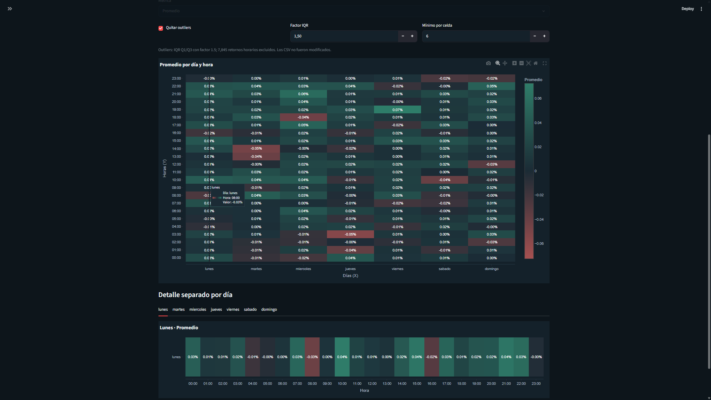
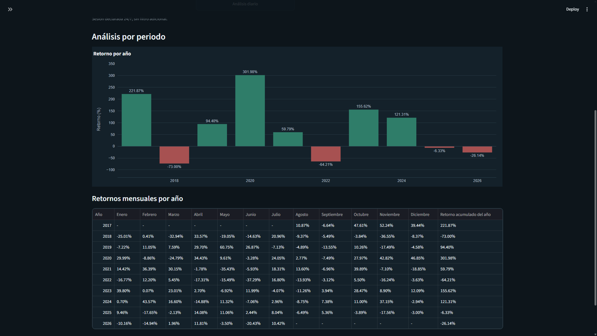
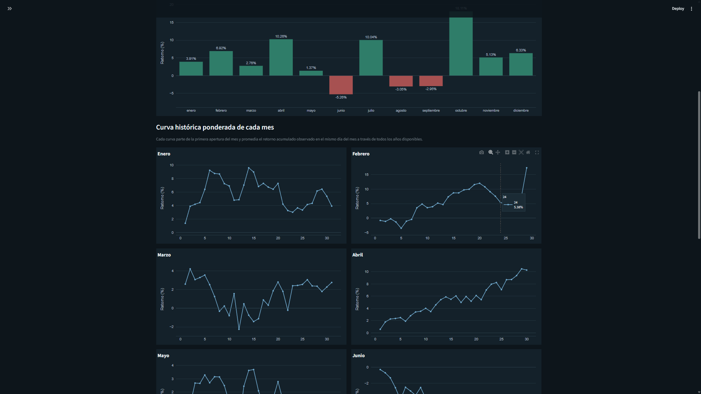
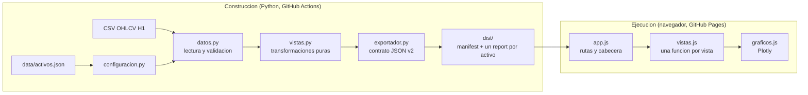

# Seasonal Market Dashboard | Analisis estacional H1

[Sitio publicado](https://seggov.github.io/seasonal-market-dashboard/) ·
[Repositorio](https://github.com/Seggov/seasonal-market-dashboard)

Panel **estatico** para explorar patrones temporales en **604.111 velas OHLCV
H1** de ocho instrumentos financieros. Python valida los datos y genera JSON
versionado durante la construccion; el sitio publicado es HTML, CSS y
JavaScript vanilla sobre GitHub Pages, **sin backend y sin Python en tiempo de
ejecucion**.

El reparto es estricto: **Python analiza y exporta, el navegador dibuja**. La
pagina no recalcula nada ni ofrece controles de analisis; lee un JSON con los
resultados ya calculados y los representa.

> El proyecto es una herramienta de exploracion estadistica. No genera senales,
> predicciones ni recomendaciones de inversion.

## Vista principal: matriz dia-hora

La matriz cruza el dia de la semana con la hora local del mercado y muestra el
retorno medio de cada celda. Las celdas con menos de cinco observaciones quedan
vacias.



Las capturas corresponden a la version Streamlit original, cuyo comportamiento
la version estatica reproduce; la disposicion visual cambia, los numeros no.
Los resultados son descriptivos y pueden incluir periodos parciales, como el mes
o ano en curso.

## Por que realice este proyecto

Realice este proyecto para convertir historiales financieros dispersos en una
herramienta reproducible y facil de inspeccionar. Queria ir mas alla de un
notebook aislado y construir una aplicacion donde fuera posible:

- comparar patrones estacionales sin mezclar instrumentos que no son
  equivalentes, como un indice oficial y su CFD;
- trabajar con datos locales y resultados reproducibles, sin depender de la
  disponibilidad de una API al abrir el dashboard;
- hacer visible la calidad de los datos antes de analizarlos;
- respetar UTC, zonas horarias IANA, DST y sesiones de mercado;
- evitar rellenar huecos o fabricar velas que no existen en la fuente;
- separar configuracion, validacion, estadistica, cache e interfaz para poder
  probar cada responsabilidad de forma independiente.

El objetivo no es demostrar que un patron sea rentable. El dashboard ayuda a
formular preguntas, comparar periodos y detectar comportamientos que despues
deberian evaluarse con tecnicas inferenciales y pruebas fuera de muestra.

## Que permite explorar

Nueve vistas, todas graficas:

1. **Resumen:** cierre, retorno del ultimo mes y ano, proporcion de velas
   positivas y grafico de velas.
2. **Anual:** retorno por ano y mapa de calor ano x mes.
3. **Mensual:** retorno medio por mes y las doce curvas historicas intrames.
4. **Semanal:** estacionalidad por semana ISO y curva frente al promedio.
5. **Dia de la semana:** retorno medio por dia y las siete curvas intradia.
6. **Dia del mes:** comportamiento por dia del mes y mapa de calor.
7. **Horario:** retorno medio por hora y curvas por dia de la semana.
8. **Matriz dia-hora:** mapa de calor de retorno medio.
9. **Extremos:** los diez mejores y peores dias.

El unico control es la navegacion: instrumento y vista. Ambos viajan en el hash
de la URL (`#/XAUUSD/matriz`), asi que cualquier vista es enlazable.

## Mas capturas

### Retornos anuales y mensuales



### Curvas historicas por mes



## Datos incluidos

El snapshot versionado fue actualizado el **26 de julio de 2026** y contiene
ocho instrumentos con coberturas diferentes:

| Simbolo | Instrumento y fuente | Filas | Cobertura UTC | Zona de analisis |
|---|---|---:|---|---|
| `BTCUSDT` | Bitcoin/USDT spot, Binance | 78.245 | 2017-08-17 a 2026-07-26 | UTC |
| `SP500` | S&P 500 oficial `^GSPC`, Yahoo Finance | 5.081 | 2023-08-25 a 2026-07-24 | `America/New_York` |
| `NIKKEI225` | Nikkei 225 oficial `^N225`, Yahoo Finance | 5.090 | 2023-07-28 a 2026-07-24 | `Asia/Tokyo` |
| `USA500IDXUSD` | US 500 CFD bid, Dukascopy | 74.294 | 2011-09-18 a 2026-07-24 | `America/New_York` |
| `JPNIDXJPY` | Japan 225 CFD bid, Dukascopy | 75.722 | 2011-09-18 a 2026-07-24 | `Asia/Tokyo` |
| `XAUUSD` | Oro spot bid, Dukascopy | 140.352 | 2003-05-05 a 2026-07-24 | `America/New_York` |
| `XAGUSD` | Plata spot bid, Dukascopy | 139.418 | 2003-05-04 a 2026-07-24 | `America/New_York` |
| `WTI_LIGHTCMDUSD` | Petroleo WTI CFD bid, Dukascopy | 85.909 | 2011-09-23 a 2026-07-24 | `America/New_York` |

Los indices oficiales y sus CFD se mantienen separados. Aunque representen
mercados relacionados, tienen proveedores, sesiones, coberturas, precios y
semantica de volumen diferentes.

La procedencia completa, las fechas exactas y los ajustes previos estan
documentados en [`data/FUENTES_DATOS.txt`](data/FUENTES_DATOS.txt).

## Arquitectura

La frontera entre construccion y ejecucion es estricta: Python solo interviene
antes de publicar.



El navegador no contiene logica analitica: si un numero aparece en pantalla, lo
calculo Python durante la construccion. Eso hace que la unica implementacion del
analisis sea la que esta bajo prueba.

### Responsabilidad de cada modulo

**Construccion (Python):**

| Componente | Responsabilidad |
|---|---|
| `src/configuracion.py` | Lee `activos.json`, valida campos, rutas y zonas IANA, y construye el catalogo. |
| `src/datos.py` | Lee CSV como texto, valida OHLCV, separa filas invalidas, convierte UTC y calcula retornos por vela. |
| `src/analisis.py` | Agrega periodos y calcula estadistica descriptiva, estacionalidad, IQR, matrices y extremos. |
| `src/vistas.py` | Transformaciones puras de cada vista, sin capa de presentacion. |
| `src/exportador.py` | Construye el contrato JSON: manifiesto e informes con las nueve vistas ya calculadas. |
| `src/cache.py` | Firma datos y configuracion y verifica integridad con SHA-256. |
| `tools/build_web.py` | Genera `dist/` completo. |
| `tools/check_dist.py` | Valida presupuestos, enlaces, JSON estricto y ausencia de rutas absolutas. |
| `tools/serve.py` | Sirve `dist/` en local bajo el mismo prefijo que GitHub Pages. |

**Ejecucion (JavaScript vanilla, sin dependencias de tiempo de ejecucion):**

| Componente | Responsabilidad |
|---|---|
| `web/index.html` | Cabecera, pestanas de instrumento y de vista, contenedor. |
| `web/assets/app.css` | Paleta oscura y tipografia monoespaciada; responsive. |
| `web/assets/app.js` | Arranque, enrutado por hash y cabecera del instrumento. |
| `web/assets/vistas.js` | Una funcion por vista; solo presentacion. |
| `web/assets/graficos.js` | Envoltorio de Plotly 2.35.2 vendorizado, sin CDN. |
| `web/assets/ui.js` | Formato numerico y calendario del mercado. |
| `.github/workflows/pages.yml` | Construye, verifica, valida y despliega en GitHub Pages. |

### Estructura del repositorio

```text
seasonal-market-dashboard/
|-- data/                     fuentes: activos.json y ocho CSV H1
|-- src/                      nucleo Python de construccion
|   |-- configuracion.py
|   |-- datos.py
|   |-- analisis.py
|   |-- vistas.py
|   |-- exportador.py
|   `-- cache.py
|-- web/                      aplicacion estatica (fuente)
|   |-- index.html
|   |-- assets/
|   |   |-- app.css
|   |   |-- app.js
|   |   |-- graficos.js
|   |   |-- ui.js
|   |   |-- vistas.js
|   |   `-- vendor/           plotly-2.35.2.min.js
|-- tools/                    build_web, check_dist, serve
|-- tests/                    pruebas de Python
|-- docs/                     PARIDAD.md, CONTRATO_JSON.md, imagenes
|-- dist/                     artefacto generado (no versionado)
|-- .github/workflows/pages.yml
|-- requirements.txt
`-- README.md
```

`dist/` **no se versiona**: lo genera GitHub Actions en cada despliegue.

## Flujo de procesamiento

1. `configuracion.py` carga dinamicamente cada activo declarado en
   `data/activos.json`.
2. El CSV se lee inicialmente como texto para conservar la representacion de
   origen.
3. `datos.py` valida columnas, timestamps, finitud, precios, volumen,
   coherencia OHLC y duplicados.
4. Los timestamps se conservan en UTC y se convierten a la zona IANA del
   mercado para el analisis local.
5. Se calcula el retorno de cada vela desde `open` y `close`.
6. `vistas.py` aplica la sesion declarada y calcula las nueve vistas.
7. `exportador.py` las serializa en un unico `report.json` por instrumento.
8. `tools/build_web.py` escribe `dist/` y `tools/check_dist.py` lo valida.

A partir de aqui **no interviene Python**. En el navegador:

9. `app.js` lee `manifest.json` y pinta las pestanas de instrumento.
10. Al elegir uno se descarga su unico `report.json` y se dibuja la vista.

No hay llamadas de red a servicios de mercado en ningun punto del flujo, ni
almacenamiento en el navegador.

### Actualizacion de los datos

El repositorio versiona *snapshots* ya preparados y **no incluye un pipeline de
descarga** desde Binance, Yahoo Finance o Dukascopy. Para publicar datos nuevos
hay que reemplazar los CSV de `data/`, volver a construir y desplegar.

Una actualizacion automatica futura necesitaria dos piezas que hoy no existen:
un pipeline de descarga y normalizacion, y un workflow programado que lo
ejecute y vuelva a desplegar. En ningun caso deben usarse secretos en el
frontend: las credenciales de un proveedor solo tendrian sentido en el workflow.

La fecha que muestra el panel es `generatedAt` del manifiesto, es decir **cuando
se genero el artefacto**, no la hora del navegador ni la ultima vela del
mercado.

## Contrato y validacion OHLCV

Cada CSV debe contener exactamente estas columnas:

```text
timestamp_utc,open,high,low,close,volume
```

Reglas principales:

- `timestamp_utc` debe ser interpretable como fecha valida;
- `open`, `high`, `low` y `close` deben ser numericos, finitos y no negativos;
- `volume` puede estar vacio, pero debe ser finito y no negativo cuando existe;
- `high` no puede ser menor que `low`, `open` o `close`;
- `low` no puede ser mayor que `open` o `close`;
- los duplicados posteriores se excluyen y se conserva la primera aparicion;
- los huecos no se rellenan y no se generan velas sinteticas.

El simbolo, mercado, timeframe, sesion, fuente y zona horaria proceden de
`activos.json`. El retorno se calcula desde los precios validados; no se confia
en un porcentaje precalculado por la fuente.

## Metodologia de retornos

Para una vela o un periodo agregado se utiliza:

```text
retorno_porcentual = (cierre_final / apertura_inicial - 1) * 100
```

Para periodos de mayor duracion se toma la primera apertura y el ultimo cierre
en orden cronologico. Los retornos simples de las velas no se suman.

El nucleo calcula:

- media, mediana, minimo, maximo, rango y desviacion estandar muestral;
- porcentaje de periodos positivos, negativos y neutros;
- agregacion por hora, dia, semana ISO, mes y ano;
- estacionalidad por mes, semana, dia de semana, dia del mes y hora;
- matriz dia-hora con cinco metricas seleccionables;
- filtro opcional de outliers mediante IQR;
- eventos extremos por ranking o umbral absoluto.

Los promedios mostrados son medias aritmeticas. No se ponderan por volumen,
capital, volatilidad ni tamano de muestra.

## Zonas horarias, DST y sesiones

- Los snapshots actuales almacenan timestamps UTC.
- Cada activo declara una zona IANA, por ejemplo `America/New_York` o
  `Asia/Tokyo`.
- Las agrupaciones por dia, semana, mes y hora se realizan sobre el calendario
  local del activo.
- El offset UTC se conserva al agregar horas para distinguir repeticiones
  causadas por el fin del horario de verano.
- Las barras Yahoo que comienzan a `HH:30` conservan su timestamp, pero la
  estacionalidad horaria las agrupa por la hora entera y etiqueta el bucket como
  `HH:00`.

Modos de sesion:

- **Declarada:** conserva las observaciones publicadas para la sesion indicada.
  No inventa un calendario bursatil.
- **Observada:** permite seleccionar dias y horas presentes en el archivo.
- **Personalizada:** aplica un intervalo `[inicio, fin)` y admite sesiones que
  cruzan medianoche.

`BTCUSDT` usa sesion `24/7`, por lo que conserva toda la serie. La rejilla
esperada puede calcularse con precision, pero el snapshot contiene huecos y no
debe describirse como una serie perfectamente continua.

## Cache e integridad

Existen dos mecanismos distintos, y conviene no confundirlos.

**Invalidacion del sitio publicado.** Cada `report.json` lleva un **hash de
contenido en el nombre**, asi que un archivo nuevo nunca reutiliza la respuesta
cacheada del anterior. `manifest.json` es el unico recurso sin hash y se pide
con `cache: "no-cache"`. El manifiesto declara ademas `contentHash` y
`processingVersion` del conjunto completo.

**Cache Parquet de construccion (`src/cache.py`).** Firma el CSV y
`activos.json` por ruta, tamano, fecha de modificacion y SHA-256, mas una
version explicita de procesamiento; escribe con archivos temporales y
reemplazo atomico, e invalida cualquier pareja incompleta o corrupta.

> Este segundo mecanismo existia para acelerar los *reruns* de Streamlit. El
> generador lee cada CSV una sola vez, asi que ya **no forma parte de la ruta de
> construccion**. El modulo se conserva con su cobertura de pruebas intacta;
> retirarlo seria un cambio independiente.

## Tecnologias

| Area | Tecnologia |
|---|---|
| Interfaz | HTML semantico, CSS responsive, JavaScript vanilla (ES Modules) |
| Calculo | Integramente en construccion: Python, Pandas, NumPy |
| Visualizacion | Plotly.js 2.35.2 vendorizado (sin CDN) |
| Contrato de datos | JSON estricto versionado, con las vistas ya calculadas |
| Zonas horarias | `zoneinfo` y `tzdata` en construccion; epoch local al publicar |
| Pruebas | Pytest |
| Alojamiento | GitHub Pages |
| Integracion continua | GitHub Actions |

Sin React, Vue, Angular ni Streamlit. Sin dependencias de npm y sin peticiones a
terceros: todos los recursos se sirven desde el propio sitio.

## Despliegue

El sitio se publica automaticamente en
<https://seggov.github.io/seasonal-market-dashboard/> mediante
`.github/workflows/pages.yml`:

1. Push a `main` (o ejecucion manual desde la pestana **Actions**).
2. El workflow instala Python 3.13, ejecuta las pruebas, genera `dist/` y lo
   valida con `check_dist.py`.
3. Sube el artefacto con `actions/upload-pages-artifact` y despliega con
   `actions/deploy-pages`, en el entorno `github-pages`.

Los pull requests ejecutan las mismas comprobaciones pero **no despliegan**.

### Configuracion necesaria una sola vez

En **Settings → Pages** del repositorio, la fuente (*Source*) debe estar en
**GitHub Actions**, no en una rama. Sin ese ajuste el workflow construye y
verifica correctamente, pero el paso de despliegue falla.

### Rutas y subdirectorio

El sitio vive bajo `/seasonal-market-dashboard/`, asi que **todas** las
referencias a HTML, CSS, JavaScript y JSON son relativas; no existe ninguna que
empiece por `/`. `tools/check_dist.py` falla la construccion si aparece una.
La navegacion usa *hash routing* (`#/BTCUSDT/matriz?metrica=median`) para no
depender de reescrituras del servidor, y el build genera `.nojekyll`.

## Instalacion

Para **construir** el sitio hace falta Python 3.10 o superior (CI fija 3.13).
Para **ver** el sitio publicado solo hace falta un navegador moderno.

```powershell
git clone https://github.com/Seggov/seasonal-market-dashboard.git
Set-Location "seasonal-market-dashboard"
python -m venv .venv
.venv\Scripts\Activate.ps1
python -m pip install --upgrade pip
python -m pip install -r requirements.txt
```

No hay dependencias de npm ni de Node: Plotly esta vendorizado en
`web/assets/vendor/` con version fijada y el resto es JavaScript vanilla.

## Construccion y desarrollo local

```powershell
python tools/build_web.py          # genera dist/ completo
python tools/check_dist.py         # valida presupuestos, enlaces y rutas
python tools/serve.py              # sirve dist/ en http://127.0.0.1:8000/seasonal-market-dashboard/
```

`tools/serve.py` sirve el sitio bajo **el mismo prefijo que GitHub Pages**, que
es la unica forma fiable de detectar una ruta absoluta que solo funcionaria en
la raiz. Con `--raiz` se comprueba tambien que funciona servido en `/`.

> No abra `index.html` con `file://`: los modulos ES y `fetch` exigen un origen
> HTTP real.

Opciones utiles durante el desarrollo:

```powershell
python tools/build_web.py --activos BTCUSDT SP500   # solo dos activos, mas rapido
python tools/build_web.py --solo-datos              # regenera dist/data sin recopiar la app
python tools/serve.py --raiz --abrir                # sirve en / y abre el navegador
```

La generacion completa tarda **menos de dos minutos** y produce un artefacto de
**5,7 MB**, del que 4,35 MB son la biblioteca de graficos: los ocho informes
suman 1,3 MB.

## Pruebas y CI

```powershell
python -m pytest -q
```

**94 casos** que cubren:

- configuraciones validas, invalidas y modo tolerante;
- contrato CSV, OHLC, duplicados, retornos y metadata derivada;
- zonas horarias, DST de primavera y otono, semanas ISO que cruzan de ano,
  velas en `HH:30` y sesiones que cruzan medianoche;
- cobertura `24/7` y `24/5`;
- firmas, roundtrip e invalidacion de cache corrupta;
- transformaciones de vista extraidas de la capa de presentacion;
- contrato JSON: saneamiento estricto, epochs independientes de la resolucion
  interna de pandas, forma de cada vista y ausencia de rutas absolutas.

No hay pruebas de JavaScript porque el navegador no calcula: dibuja lo que el
JSON trae. `tools/check_dist.py` comprueba ademas que cada informe publicado
lleve las nueve vistas.

GitHub Actions ejecuta todo lo anterior en cada push y pull request a `main`.
La verificacion visual de las nueve vistas en escritorio y movil se hace a mano
antes de publicar.

## Como agregar un activo

1. Normaliza el historial al contrato OHLCV H1.
2. Guarda el CSV dentro de `data/`.
3. Agrega una entrada a `data/activos.json` con mercado, sesion, zona IANA,
   timeframe, archivo y tipo de timestamp.
4. Documenta proveedor, cobertura y transformaciones en
   `data/FUENTES_DATOS.txt`.
5. Ejecuta la suite de pruebas.

El cargador descubre simbolos dinamicamente. La prueba de regresion del
catalogo actual fija los ocho simbolos versionados, por lo que debe actualizarse
si se incorpora un noveno activo al snapshot oficial.

## Procedencia de precios y volumen

- BTC usa precios y volumen spot de Binance.
- Los indices Yahoo pueden publicar volumen cero o no disponible.
- Dukascopy aporta precios `bid` y volumen del proveedor, no volumen oficial de
  la bolsa o mercado subyacente.
- El volumen se valida, pero actualmente no se analiza ni visualiza.
- Cuarenta y una velas WTI tuvieron antes de ser incorporadas un ajuste maximo
  de `0.002` en `high/low` para restaurar coherencia OHLC. El detalle esta en
  `data/FUENTES_DATOS.txt`.

El proyecto versiona snapshots ya preparados. No incluye el pipeline de
descarga o regeneracion desde Binance, Yahoo Finance o Dukascopy.

## Estructura de los datos publicados

El contrato completo esta en [`docs/CONTRATO_JSON.md`](docs/CONTRATO_JSON.md).
Resumen:

```text
dist/data/
|-- manifest.json              catalogo minimo: instrumentos, rango y enlaces
|-- BTCUSDT/
|   `-- report.<hash>.json     las nueve vistas ya calculadas
`-- ...
```

- **`schemaVersion`** actual: `2`. Cada archivo la declara.
- **JSON estricto**: no se emiten `NaN` ni infinitos; todo valor no finito viaja
  como `null`.
- **Solo lo que se dibuja**: cada fila estacional lleva la clave del eje, el
  promedio y el tamano de muestra. No se publican las velas base.
- **Un archivo por instrumento**: solo se descarga el seleccionado.
- **Tiempo sin ambiguedad**: las marcas que se dibujan viajan como *epoch local*
  del mercado (instante absoluto mas desplazamiento). El cliente deriva la fecha
  con aritmetica civil exacta, sin construir un `Date`. **La zona horaria del
  navegador nunca interviene.**
- **Invalidacion de cache**: cada informe lleva un hash de contenido en el
  nombre; solo `manifest.json` se pide con `cache: "no-cache"`.

El detalle completo esta en [`docs/CONTRATO_JSON.md`](docs/CONTRATO_JSON.md).

## Diferencias conocidas respecto a la version Streamlit

`docs/PARIDAD.md` fija el comportamiento efectivo del codigo original, incluidas
sus ambiguedades (A-1 a A-12), y las pruebas verifican que el nucleo las
conserva. Lo que cambia es el alcance de la interfaz:

| Antes | Ahora | Motivo |
|---|---|---|
| Sesion declarada, observada o personalizada | Solo la declarada | El sitio es de lectura; el analisis se publica ya calculado. |
| Filtro IQR, metrica de matriz y ranking configurables | Valores fijos (ver `PARIDAD.md` 1.3) | Cada control obligaba a recalcular en el navegador. |
| Vista «Calidad de datos» | No se publica | Era una tabla de conteos, no una visualizacion. |
| Tablas de estadisticas bajo cada vista | Solo graficos | Peticion explicita: menos saturacion. |
| Tema claro y oscuro | Solo oscuro | Identidad de terminal de mercado. |
| Boton «Actualizar datos y cache» | Ninguna accion | No hay nada que reprocesar en vivo. |
| Estado en `st.session_state` | Estado en la URL (`#/SIMBOLO/vista`) | Cualquier vista es enlazable. |

Los modos de sesion y los filtros siguen implementados y probados en
`src/vistas.py`: definen la semantica de lo que se publica, aunque no se
expongan como control.

## Limitaciones

- El sitio no descarga datos: publica un snapshot generado en la construccion.
- No es interactivo: no se pueden cambiar sesion, filtros ni metricas desde la
  pagina. Cambiarlos exige regenerar y volver a desplegar.
- No hay pruebas de navegador end-to-end automatizadas.
- Las coberturas historicas y los tamanos de muestra difieren entre activos.
- No se implementan calendarios bursatiles, festivos ni cierres anticipados.
- Los periodos incompletos se marcan, pero siguen participando en promedios y
  visualizaciones.
- El analisis es descriptivo: no calcula intervalos de confianza, significancia
  estadistica ni estabilidad fuera de muestra.
- No hay adjusted close, dividendos, splits, spread bid-ask, comisiones ni
  slippage.
- No hay comparacion simultanea multi-activo ni analisis de cartera.
- No hay indicadores tecnicos, senales, optimizacion, backtesting o
  predicciones.
- No hay actualizacion automatica de los datos ni exportacion desde la interfaz.
- Los resultados no constituyen asesoramiento financiero.
