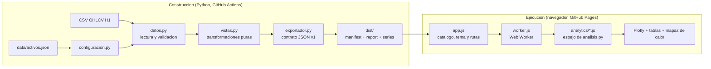

# Seasonal Market Dashboard | Analisis estacional H1

[Sitio publicado](https://seggov.github.io/seasonal-market-dashboard/) ·
[Repositorio](https://github.com/Seggov/seasonal-market-dashboard)

Panel **estatico** para explorar patrones temporales en **604.111 velas OHLCV
H1** de ocho instrumentos financieros. Python valida los datos y genera JSON
versionado durante la construccion; el sitio publicado es HTML, CSS y
JavaScript vanilla sobre GitHub Pages, **sin backend y sin Python en tiempo de
ejecucion**.

Todo el calculo interactivo -- sesiones, filtros IQR, matriz dia-hora y eventos
extremos -- ocurre en el navegador dentro de un Web Worker, sobre los mismos
datos que valido Python.

> El proyecto es una herramienta de exploracion estadistica. No genera senales,
> predicciones ni recomendaciones de inversion.

## Vista principal: matriz dia-hora

La matriz cruza el dia de la semana con la hora local del mercado. Permite
alternar entre media, mediana, porcentaje positivo, desviacion y numero de
observaciones, ademas de aplicar un filtro IQR y un minimo de muestras por
celda.


Las capturas corresponden a la version Streamlit original, cuyo comportamiento
la version estatica reproduce; la disposicion visual cambia, los numeros no.
Los resultados son descriptivos y pueden incluir periodos parciales, como el mes
o ano en curso.

## Por que realice este proyecto

Realice este proyecto para convertir historiales financieros dispersos en una
herramienta reproducible y facil de inspeccionar. Queria ir mas alla de un
notebook aislado y construir una aplicacion donde fuera posible:

- comparar patrones estacionales sin mezclar instrumentos que no son
  equivalentes, como un indice oficial y su CFD;
- trabajar con datos locales y resultados reproducibles, sin depender de la
  disponibilidad de una API al abrir el dashboard;
- hacer visible la calidad de los datos antes de analizarlos;
- respetar UTC, zonas horarias IANA, DST y sesiones de mercado;
- evitar rellenar huecos o fabricar velas que no existen en la fuente;
- separar configuracion, validacion, estadistica, cache e interfaz para poder
  probar cada responsabilidad de forma independiente.

El objetivo no es demostrar que un patron sea rentable. El dashboard ayuda a
formular preguntas, comparar periodos y detectar comportamientos que despues
deberian evaluarse con tecnicas inferenciales y pruebas fuera de muestra.

## Que permite explorar

La interfaz incluye diez vistas:

1. **Resumen:** cierre reciente, retornos, proporcion de velas positivas y
   candlestick.
2. **Calidad de datos:** filas totales, validas, eliminadas y rango temporal.
3. **Analisis por periodo:** retornos por ano y tabla mensual por ano.
4. **Analisis mensual:** retorno promedio por mes y trayectorias intrames.
5. **Analisis semanal:** estacionalidad por semana ISO con filtro IQR opcional.
6. **Dia de la semana:** retorno diario y trayectorias intradia.
7. **Analisis diario:** comportamiento por dia del mes y heatmap.
8. **Analisis horario:** retorno promedio por hora local.
9. **Matriz dia-hora:** heatmap general y detalle separado por dia.
10. **Eventos extremos:** mejores, peores o movimientos sobre un umbral.

Tambien permite cambiar entre tema claro y oscuro, escoger el activo, aplicar
sesiones declaradas, observadas o personalizadas, recargar la version publicada
y limpiar la cache que la aplicacion guarda en el navegador.

Cada vista es enlazable: el activo, la vista y los filtros viajan en el hash de
la URL, por ejemplo `#/XAUUSD/matriz?metrica=median&min=20`.

## Mas capturas

### Retornos anuales y mensuales


### Curvas historicas por mes


## Datos incluidos

El snapshot versionado fue actualizado el **26 de julio de 2026** y contiene
ocho instrumentos con coberturas diferentes:

| Simbolo | Instrumento y fuente | Filas | Cobertura UTC | Zona de analisis |
|---|---|---:|---|---|
| `BTCUSDT` | Bitcoin/USDT spot, Binance | 78.245 | 2017-08-17 a 2026-07-26 | UTC |
| `SP500` | S&P 500 oficial `^GSPC`, Yahoo Finance | 5.081 | 2023-08-25 a 2026-07-24 | `America/New_York` |
| `NIKKEI225` | Nikkei 225 oficial `^N225`, Yahoo Finance | 5.090 | 2023-07-28 a 2026-07-24 | `Asia/Tokyo` |
| `USA500IDXUSD` | US 500 CFD bid, Dukascopy | 74.294 | 2011-09-18 a 2026-07-24 | `America/New_York` |
| `JPNIDXJPY` | Japan 225 CFD bid, Dukascopy | 75.722 | 2011-09-18 a 2026-07-24 | `Asia/Tokyo` |
| `XAUUSD` | Oro spot bid, Dukascopy | 140.352 | 2003-05-05 a 2026-07-24 | `America/New_York` |
| `XAGUSD` | Plata spot bid, Dukascopy | 139.418 | 2003-05-04 a 2026-07-24 | `America/New_York` |
| `WTI_LIGHTCMDUSD` | Petroleo WTI CFD bid, Dukascopy | 85.909 | 2011-09-23 a 2026-07-24 | `America/New_York` |

Los indices oficiales y sus CFD se mantienen separados. Aunque representen
mercados relacionados, tienen proveedores, sesiones, coberturas, precios y
semantica de volumen diferentes.

La procedencia completa, las fechas exactas y los ajustes previos estan
documentados en [`data/FUENTES_DATOS.txt`](data/FUENTES_DATOS.txt).

## Arquitectura

La frontera entre construccion y ejecucion es estricta: Python solo interviene
antes de publicar.



El nucleo analitico existe dos veces, deliberadamente: en Python para generar
las vistas predeterminadas y en JavaScript para recalcularlas cuando cambia un
filtro. Las pruebas de paridad comparan ambas salidas en cada ejecucion de CI,
de modo que no pueden divergir en silencio.

### Responsabilidad de cada modulo

**Construccion (Python):**

| Componente | Responsabilidad |
|---|---|
| `src/configuracion.py` | Lee `activos.json`, valida campos, rutas y zonas IANA, y construye el catalogo. |
| `src/datos.py` | Lee CSV como texto, valida OHLCV, separa filas invalidas, convierte UTC y calcula retornos por vela. |
| `src/analisis.py` | Agrega periodos y calcula estadistica descriptiva, estacionalidad, IQR, matrices y extremos. |
| `src/vistas.py` | Transformaciones puras de cada vista, sin capa de presentacion. |
| `src/exportador.py` | Construye el contrato JSON: manifiesto, informes, series columnares y tablas de zona horaria. |
| `src/cache.py` | Firma datos y configuracion y verifica integridad con SHA-256. |
| `tools/build_web.py` | Genera `dist/` completo. |
| `tools/check_dist.py` | Valida presupuestos, enlaces, JSON estricto y ausencia de rutas absolutas. |
| `tools/serve.py` | Sirve `dist/` en local bajo el mismo prefijo que GitHub Pages. |
| `tools/generar_paridad_filtros.py` | Genera las fixturas doradas de filtros no predeterminados. |

**Ejecucion (JavaScript vanilla, sin dependencias de tiempo de ejecucion):**

| Componente | Responsabilidad |
|---|---|
| `web/index.html` | Estructura semantica, panel de filtros y contenedor de vistas. |
| `web/assets/app.css` | Temas claro y oscuro, disposicion responsive. |
| `web/assets/app.js` | Arranque, catalogo, navegacion, tema y orquestacion del worker. |
| `web/assets/estado.js` | Estado, enrutado por hash y serializacion de filtros en la URL. |
| `web/assets/worker.js` | Descarga, decodifica y recalcula las vistas fuera del hilo principal. |
| `web/assets/analytics/*.js` | Espejo exacto del nucleo analitico de Python. |
| `web/assets/vistas/*.js` | Renderizado de cada vista. |
| `web/assets/graficos.js` | Envoltorio de Plotly 2.35.2 vendorizado, sin CDN. |
| `web/tests/` | Pruebas de paridad Python/JavaScript con `node --test`. |
| `.github/workflows/pages.yml` | Construye, verifica, valida y despliega en GitHub Pages. |

### Estructura del repositorio

```text
seasonal-market-dashboard/
|-- data/                     fuentes: activos.json y ocho CSV H1
|-- src/                      nucleo Python de construccion
|   |-- configuracion.py
|   |-- datos.py
|   |-- analisis.py
|   |-- vistas.py
|   |-- exportador.py
|   `-- cache.py
|-- web/                      aplicacion estatica (fuente)
|   |-- index.html
|   |-- assets/
|   |   |-- app.css
|   |   |-- app.js
|   |   |-- estado.js
|   |   |-- graficos.js
|   |   |-- ui.js
|   |   |-- worker.js
|   |   |-- analytics/        nucleo analitico en JavaScript
|   |   |-- vistas/           renderizado de cada vista
|   |   `-- vendor/           plotly-2.35.2.min.js
|   `-- tests/                pruebas de paridad (node --test)
|-- tools/                    build_web, check_dist, serve, fixturas
|-- tests/                    pruebas de Python + fixturas doradas
|-- docs/                     PARIDAD.md, CONTRATO_JSON.md, imagenes
|-- dist/                     artefacto generado (no versionado)
|-- .github/workflows/pages.yml
|-- requirements.txt
`-- README.md
```

`dist/` **no se versiona**: lo genera GitHub Actions en cada despliegue.

## Flujo de procesamiento

1. `configuracion.py` carga dinamicamente cada activo declarado en
   `data/activos.json`.
2. El CSV se lee inicialmente como texto para conservar la representacion de
   origen.
3. `datos.py` valida columnas, timestamps, finitud, precios, volumen,
   coherencia OHLC y duplicados.
4. Los timestamps se conservan en UTC y se convierten a la zona IANA del
   mercado para el analisis local.
5. Se calcula el retorno de cada vela desde `open` y `close`.
6. `vistas.py` aplica la sesion declarada y calcula las diez vistas
   predeterminadas.
7. `exportador.py` las serializa junto con las series fragmentadas por ano y la
   tabla de transiciones de la zona del mercado.
8. `tools/build_web.py` escribe `dist/` y `tools/check_dist.py` lo valida.

A partir de aqui **no interviene Python**. En el navegador:

9. `app.js` lee `manifest.json` y pinta el catalogo precalculado.
10. Al elegir un activo se descargan su informe y sus series por ano; las vistas
    predeterminadas se pintan de inmediato desde `report.json`.
11. Cualquier cambio de filtro se envia al Web Worker, que recalcula las nueve
    cargas analiticas sobre los indices de la serie ya decodificada.

No hay llamadas de red a servicios de mercado en ningun punto del flujo.
**Recargar version publicada** vuelve a pedir el manifiesto y **Limpiar cache
local** vacia lo que la aplicacion haya guardado en el navegador; ninguno de los
dos descarga precios nuevos.

### Actualizacion de los datos

El repositorio versiona *snapshots* ya preparados y **no incluye un pipeline de
descarga** desde Binance, Yahoo Finance o Dukascopy. Para publicar datos nuevos
hay que reemplazar los CSV de `data/`, volver a construir y desplegar.

Una actualizacion automatica futura necesitaria dos piezas que hoy no existen:
un pipeline de descarga y normalizacion, y un workflow programado que lo
ejecute y vuelva a desplegar. En ningun caso deben usarse secretos en el
frontend: las credenciales de un proveedor solo tendrian sentido en el workflow.

La fecha que muestra el panel es `generatedAt` del manifiesto, es decir **cuando
se genero el artefacto**, no la hora del navegador ni la ultima vela del
mercado.

## Contrato y validacion OHLCV

Cada CSV debe contener exactamente estas columnas:

```text
timestamp_utc,open,high,low,close,volume
```

Reglas principales:

- `timestamp_utc` debe ser interpretable como fecha valida;
- `open`, `high`, `low` y `close` deben ser numericos, finitos y no negativos;
- `volume` puede estar vacio, pero debe ser finito y no negativo cuando existe;
- `high` no puede ser menor que `low`, `open` o `close`;
- `low` no puede ser mayor que `open` o `close`;
- los duplicados posteriores se excluyen y se conserva la primera aparicion;
- los huecos no se rellenan y no se generan velas sinteticas.

El simbolo, mercado, timeframe, sesion, fuente y zona horaria proceden de
`activos.json`. El retorno se calcula desde los precios validados; no se confia
en un porcentaje precalculado por la fuente.

## Metodologia de retornos

Para una vela o un periodo agregado se utiliza:

```text
retorno_porcentual = (cierre_final / apertura_inicial - 1) * 100
```

Para periodos de mayor duracion se toma la primera apertura y el ultimo cierre
en orden cronologico. Los retornos simples de las velas no se suman.

El nucleo calcula:

- media, mediana, minimo, maximo, rango y desviacion estandar muestral;
- porcentaje de periodos positivos, negativos y neutros;
- agregacion por hora, dia, semana ISO, mes y ano;
- estacionalidad por mes, semana, dia de semana, dia del mes y hora;
- matriz dia-hora con cinco metricas seleccionables;
- filtro opcional de outliers mediante IQR;
- eventos extremos por ranking o umbral absoluto.

Los promedios mostrados son medias aritmeticas. No se ponderan por volumen,
capital, volatilidad ni tamano de muestra.

## Zonas horarias, DST y sesiones

- Los snapshots actuales almacenan timestamps UTC.
- Cada activo declara una zona IANA, por ejemplo `America/New_York` o
  `Asia/Tokyo`.
- Las agrupaciones por dia, semana, mes y hora se realizan sobre el calendario
  local del activo.
- El offset UTC se conserva al agregar horas para distinguir repeticiones
  causadas por el fin del horario de verano.
- Las barras Yahoo que comienzan a `HH:30` conservan su timestamp, pero la
  estacionalidad horaria las agrupa por la hora entera y etiqueta el bucket como
  `HH:00`.

Modos de sesion:

- **Declarada:** conserva las observaciones publicadas para la sesion indicada.
  No inventa un calendario bursatil.
- **Observada:** permite seleccionar dias y horas presentes en el archivo.
- **Personalizada:** aplica un intervalo `[inicio, fin)` y admite sesiones que
  cruzan medianoche.

`BTCUSDT` usa sesion `24/7`, por lo que conserva toda la serie. La rejilla
esperada puede calcularse con precision, pero el snapshot contiene huecos y no
debe describirse como una serie perfectamente continua.

## Cache e integridad

Existen dos mecanismos distintos, y conviene no confundirlos.

**Invalidacion del sitio publicado.** Cada `report.json` y cada fragmento de
serie lleva un **hash de contenido en el nombre**, asi que un archivo nuevo
nunca reutiliza la respuesta cacheada del anterior. `manifest.json` es el unico
recurso sin hash y se pide con `cache: "no-cache"`. El manifiesto declara
ademas `contentHash` y `processingVersion` del conjunto completo.

**Cache Parquet de construccion (`src/cache.py`).** Firma el CSV y
`activos.json` por ruta, tamano, fecha de modificacion y SHA-256, mas una
version explicita de procesamiento; escribe con archivos temporales y
reemplazo atomico, e invalida cualquier pareja incompleta o corrupta.

> Este segundo mecanismo existia para acelerar los *reruns* de Streamlit. El
> generador estatico lee cada CSV una sola vez, asi que ya **no forma parte de
> la ruta de construccion**. El modulo se conserva con su cobertura de pruebas
> intacta; retirarlo seria un cambio independiente de esta migracion.

## Tecnologias

| Area | Tecnologia |
|---|---|
| Interfaz | HTML semantico, CSS responsive, JavaScript vanilla (ES Modules) |
| Calculo en cliente | Web Worker, arrays tipados |
| Visualizacion | Plotly.js 2.35.2 vendorizado (sin CDN) |
| Construccion | Python, Pandas, NumPy |
| Contrato de datos | JSON estricto versionado, columnar y fragmentado por ano |
| Zonas horarias | `zoneinfo`, `tzdata` y tabla de transiciones publicada |
| Pruebas | Pytest y el ejecutor nativo de Node (`node --test`) |
| Alojamiento | GitHub Pages |
| Integracion continua | GitHub Actions |

Sin React, Vue, Angular ni Streamlit en tiempo de ejecucion. Sin dependencias de
npm y sin peticiones a terceros: todos los recursos se sirven desde el propio
sitio.

## Despliegue

El sitio se publica automaticamente en
<https://seggov.github.io/seasonal-market-dashboard/> mediante
`.github/workflows/pages.yml`:

1. Push a `main` (o ejecucion manual desde la pestana **Actions**).
2. El workflow instala Python 3.13 y Node 22, ejecuta las pruebas de Python,
   genera `dist/`, lo valida con `check_dist.py` y ejecuta las pruebas de
   paridad de JavaScript contra los datos recien generados.
3. Sube el artefacto con `actions/upload-pages-artifact` y despliega con
   `actions/deploy-pages`, en el entorno `github-pages`.

Los pull requests ejecutan las mismas comprobaciones pero **no despliegan**.

### Configuracion necesaria una sola vez

En **Settings → Pages** del repositorio, la fuente (*Source*) debe estar en
**GitHub Actions**, no en una rama. Sin ese ajuste el workflow construye y
verifica correctamente, pero el paso de despliegue falla.

### Rutas y subdirectorio

El sitio vive bajo `/seasonal-market-dashboard/`, asi que **todas** las
referencias a HTML, CSS, JavaScript y JSON son relativas; no existe ninguna que
empiece por `/`. `tools/check_dist.py` falla la construccion si aparece una.
La navegacion usa *hash routing* (`#/BTCUSDT/matriz?metrica=median`) para no
depender de reescrituras del servidor, y el build genera `.nojekyll`.

## Instalacion

Para **construir** el sitio hace falta Python 3.10 o superior (CI fija 3.13) y,
para ejecutar las pruebas de JavaScript, Node 20.11 o superior (CI fija 22).
Para **ver** el sitio publicado solo hace falta un navegador moderno.

```powershell
git clone https://github.com/Seggov/seasonal-market-dashboard.git
Set-Location "seasonal-market-dashboard"
python -m venv .venv
.venv\Scripts\Activate.ps1
python -m pip install --upgrade pip
python -m pip install -r requirements.txt
```

No hay dependencias de npm: Plotly esta vendorizado en `web/assets/vendor/` con
version fijada y el resto es JavaScript vanilla.

## Construccion y desarrollo local

```powershell
python tools/build_web.py          # genera dist/ completo
python tools/check_dist.py         # valida presupuestos, enlaces y rutas
python tools/serve.py              # sirve dist/ en http://127.0.0.1:8000/seasonal-market-dashboard/
```

`tools/serve.py` sirve el sitio bajo **el mismo prefijo que GitHub Pages**, que
es la unica forma fiable de detectar una ruta absoluta que solo funcionaria en
la raiz. Con `--raiz` se comprueba tambien que funciona servido en `/`.

> No abra `index.html` con `file://`: los modulos ES, `fetch` y los Web Workers
> exigen un origen HTTP real.

Opciones utiles durante el desarrollo:

```powershell
python tools/build_web.py --activos BTCUSDT SP500   # solo dos activos, mas rapido
python tools/build_web.py --solo-datos              # regenera dist/data sin recopiar la app
python tools/serve.py --raiz --abrir                # sirve en / y abre el navegador
```

La generacion completa tarda **menos de dos minutos** y produce unos **16 MB**
de datos, muy por debajo del limite de 1 GB de GitHub Pages.

## Pruebas y CI

```powershell
python -m pytest -q                        # nucleo Python
node --test "web/tests/**/*.test.js"       # paridad Python/JavaScript
```

Las pruebas de JavaScript necesitan `dist/` generado; si no existe, se saltan
con un aviso en lugar de fallar.

**Pruebas de Python (101 casos):**

- configuraciones validas, invalidas y modo tolerante;
- contrato CSV, OHLC, duplicados, retornos y metadata derivada;
- zonas horarias, DST de primavera y otono, semanas ISO que cruzan de ano,
  velas en `HH:30` y sesiones que cruzan medianoche;
- cobertura `24/7` y `24/5`;
- firmas, roundtrip e invalidacion de cache corrupta;
- transformaciones de vista extraidas de la capa de presentacion;
- contrato JSON: saneamiento estricto, codificacion exacta de precios,
  fragmentado por ano y ausencia de rutas absolutas.

**Pruebas de JavaScript:**

- `web/tests/paridad.test.js` recalcula las diez vistas de los ocho activos y
  las compara, campo a campo, con las que genero Python en `dist/`;
- `web/tests/filtros.test.js` compara catorce configuraciones de filtros no
  predeterminados por activo mediante un digesto numerico sensible al orden.

La tolerancia aceptada esta documentada en `docs/PARIDAD.md` seccion 2.5:
**1e-9 absoluta o 1e-12 relativa** para valores en puntos porcentuales, y
exactitud binaria para precios, conteos, marcas de tiempo y banderas.

GitHub Actions ejecuta todo lo anterior en cada push y pull request a `main`.
No hay pruebas de navegador end-to-end automatizadas; la verificacion de las
diez vistas en escritorio y movil se realiza de forma manual antes de publicar.

## Como agregar un activo

1. Normaliza el historial al contrato OHLCV H1.
2. Guarda el CSV dentro de `data/`.
3. Agrega una entrada a `data/activos.json` con mercado, sesion, zona IANA,
   timeframe, archivo y tipo de timestamp.
4. Documenta proveedor, cobertura y transformaciones en
   `data/FUENTES_DATOS.txt`.
5. Ejecuta la suite de pruebas.

El cargador descubre simbolos dinamicamente. La prueba de regresion del
catalogo actual fija los ocho simbolos versionados, por lo que debe actualizarse
si se incorpora un noveno activo al snapshot oficial.

## Procedencia de precios y volumen

- BTC usa precios y volumen spot de Binance.
- Los indices Yahoo pueden publicar volumen cero o no disponible.
- Dukascopy aporta precios `bid` y volumen del proveedor, no volumen oficial de
  la bolsa o mercado subyacente.
- El volumen se valida, pero actualmente no se analiza ni visualiza.
- Cuarenta y una velas WTI tuvieron antes de ser incorporadas un ajuste maximo
  de `0.002` en `high/low` para restaurar coherencia OHLC. El detalle esta en
  `data/FUENTES_DATOS.txt`.

El proyecto versiona snapshots ya preparados. No incluye el pipeline de
descarga o regeneracion desde Binance, Yahoo Finance o Dukascopy.

## Estructura de los datos publicados

El contrato completo esta en [`docs/CONTRATO_JSON.md`](docs/CONTRATO_JSON.md).
Resumen:

```text
dist/data/
|-- manifest.json                       catalogo, versiones, hash y zonas horarias
|-- BTCUSDT/
|   |-- report.<hash>.json              calidad + las diez vistas predeterminadas
|   |-- series-2017.<hash>.json         velas del ano, columnares
|   `-- ...
`-- ...
```

- **`schemaVersion`** actual: `1`. Cada archivo la declara.
- **JSON estricto**: no se emiten `NaN` ni infinitos; todo valor no finito viaja
  como `null`.
- **Columnar y fragmentado por ano**: las 604.111 velas nunca se publican en un
  unico archivo. Solo se descarga el activo seleccionado.
- **Precios exactos**: se codifican como enteros escalados con deltas, y la
  escala solo se acepta tras verificar que `round(valor*escala)/escala == valor`
  para cada valor y que el entero cabe por debajo de `2^53`. La reconstruccion
  en el navegador es **bit a bit identica** al doble que obtuvo Python.
- **Tiempo sin ambiguedad**: cada marca viaja como instante absoluto y epoch
  local. El manifiesto incluye la tabla de transiciones de la zona IANA del
  mercado, de modo que un dia con cambio de horario mide correctamente 23 o 25
  horas. **La zona horaria del navegador nunca interviene.**
- **Invalidacion de cache**: cada archivo lleva un hash de contenido en el
  nombre; solo `manifest.json` se pide con `cache: "no-cache"`.

## Diferencias conocidas respecto a la version Streamlit

La migracion busco **paridad primero**: `docs/PARIDAD.md` fija el comportamiento
efectivo del codigo original, incluidas sus ambiguedades (A-1 a A-12), y las
pruebas verifican que se conservan. Las unicas desviaciones deliberadas son las
que impone un sitio sin backend:

| Antes | Ahora | Motivo |
|---|---|---|
| Boton **Actualizar datos y cache** | **Recargar version publicada** y **Limpiar cache local** | GitHub Pages no ejecuta Python; no hay nada que reprocesar en vivo. |
| Catalogo validado en cada carga | Catalogo precalculado en `manifest.json` | Evita revalidar ocho CSV en el navegador. |
| Tabla completa de filas invalidas | Conteos y motivos agregados en `report.json` | El detalle fila a fila no viaja al cliente. |
| Estado en `st.session_state` | Estado en la URL (`#/SIMBOLO/vista?filtros`) | Permite compartir una vista filtrada por enlace. |

Ademas, la version estatica **anade** una tabla de estadisticas descriptivas
bajo cada vista estacional y una tabla de valores bajo la matriz, que en
Streamlit solo existian como grafico.

## Limitaciones

- El sitio no descarga datos: publica un snapshot generado en la construccion.
- No hay pruebas de navegador end-to-end automatizadas.
- Las coberturas historicas y los tamanos de muestra difieren entre activos.
- No se implementan calendarios bursatiles, festivos ni cierres anticipados.
- Los periodos incompletos se marcan, pero siguen participando en promedios y
  visualizaciones.
- El analisis es descriptivo: no calcula intervalos de confianza, significancia
  estadistica ni estabilidad fuera de muestra.
- No hay adjusted close, dividendos, splits, spread bid-ask, comisiones ni
  slippage.
- No hay comparacion simultanea multi-activo ni analisis de cartera.
- No hay indicadores tecnicos, senales, optimizacion, backtesting o
  predicciones.
- No hay actualizacion automatica de los datos ni exportacion desde la interfaz.
- Los resultados no constituyen asesoramiento financiero.
